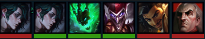
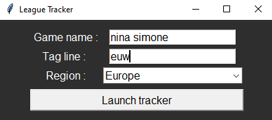
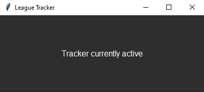
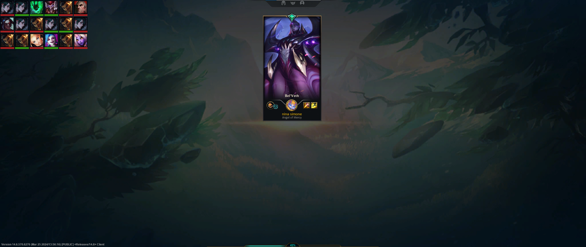

# League Tracker Overlay 

Overlay that displays a player's recent League of Legends games on the screen's top left border. \
The game data shown in the overlay is the champion played and whether the game was won or lost.

<p align='center'>

<p>


# Download and run the tracker

If you simply want to run the overlay, simply download the latest release here https://github.com/notatallshaw/fall_guys_ping_estimate/releases, extract the files from the zip, and run the .exe file.

# Login window: providing credentials

In order for the overlay to retrieve your recent games data from the Riot Games server, you are required to input some information:
* The **game name** of your account (it is your League of Legends summoner name).
* The **tag line** of your account (it depends on the account and the region it is in, check your League of Legends/Riot Games account to find the tag line).
* The **region** of your account. You can choose a region from the dropdown list.

You can then click on the Launch Tracker button.

<p align='center'>

<p>

# How to know whether the overlay is running ? 

If the provided credentials are correct, you get a message signaling that the tracker is running. This small window is hideable but must not be closed, as closing it also closes the tracker.

<p align='center'>

<p>

# Tracker data 

Every game that you play while the tracker is running will appear un the tracket overlay window after the game ends. The overlay refreshes every 30 seconds, so the maximum time it takes the tracker to load the latest game's data is 30 seconds after its end.

A game is represented by : 
* The champion played.
* A color strip undernearth the champion thumbnail that shows whether the game was won (*green*) or lost (*red*)

Every row displays 6 games.

<p align='center'>

<p>

# Cloning the repository

If you want to clone the repository, you will have to provide your own Riot API Key in order to run the tracker. You could easily generate (and regenerate after it expires every day) a Riot API key on the Riot Dev platform (https://developer.riotgames.com/), then paste it as the value for the "X-Riot-Token" key in the header dict, in the src.riot_api_wrapper.engine.Engine class. 

```
self.default_headers = {
    "User-Agent": "Mozilla/5.0 (Windows NT 10.0; Win64; x64) AppleWebKit/537.36 (KHTML, like Gecko) Chrome/123.0.0.0 Safari/537.36",
    "Accept-Language": "fr-FR,fr;q=0.9,en-US;q=0.8,en;q=0.7",
    "X-Riot-Token": "RGAPI-92609fa7-d041-421b-bd52-914f78e718dd"
}
```
